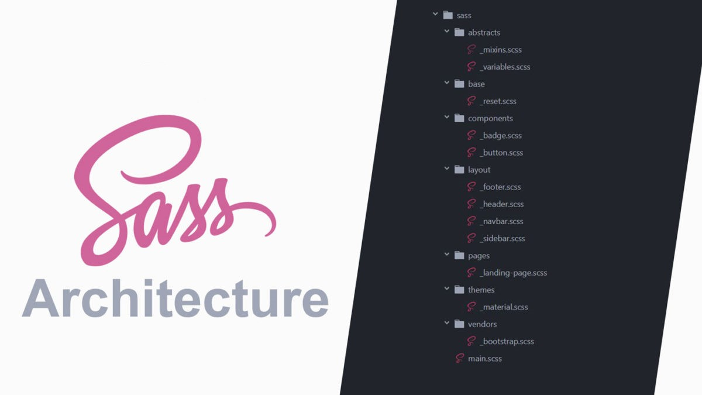

# SASS Structure Template

##  Description 👈

This is the folder structure and organize attributes neatly for newbie to learn about sass syntax.



## Setup 🚩git 

 - [IDE: Visual Studio Code Editor](https://code.visualstudio.com/)
 - [SASS](https://sass-lang.com/install)
 - [Live Sass Compiler](https://marketplace.visualstudio.com/items?itemName=ritwickdey.live-sass)
 - [Live Server](https://marketplace.visualstudio.com/items?itemName=ritwickdey.LiveServer)


## Usage 🚀

#### 1. Go to main.scss file
#### 2. Click watch sass extension in the bottom Visual Studio Code
#### 3. Open with live server
#### 4. You now can update all file with structure


## Structure 🦾

```javascript
sass/
|
|– abstracts/
|   |– _variables.scss    // Variables
|   |– _functions.scss    // Functions
|   |– _mixins.scss       // Mixins
|
|– base/
|   |– _animation.scss    // Animation
|   |– _global.scss       // Global define
|   |– _fonts.scss        // Fonts define
|   |– _reset.scss        // Reset/normalize
|   |– _utilities.scss    // utilities
|
|– components/
|   |– _buttons.scss      // Buttons
|   |– _tabs.scss         // Tabs
|   |– _slider.scss       // Slider
|
|– layout/
|   |– _navigation.scss   // Navigation
|   |– _grid.scss         // Grid system
|   |– _header.scss       // Header
|   |– _footer.scss       // Footer
|   |– _sidebar.scss      // Sidebar
|   |– _forms.scss        // Forms
|
|– pages/
|   |– _home.scss         // Home specific styles
|   |– _about.scss        // About specific styles
|   |– _contact.scss      // Contact specific styles
|
`– main.scss              // Main SASS file
@import 'abstracts/variables';
@import 'abstracts/functions';
@import 'abstracts/mixins';

// Import library from node_modules
@import 'node_modules/jquery';
@import 'node_modules/bootstrap';

@import 'base/reset';
@import 'base/fonts';
@import 'base/animation';
@import 'base/global';

@import 'layout/grid';
@import 'layout/header';
@import 'layout/footer';
@import 'layout/navigation';
@import 'layout/sidebar';
@import 'layout/forms';

@import 'components/buttons';
@import 'components/tabs';
@import 'components/slider';

@import 'pages/home';
@import 'pages/about';
@import 'pages/contact';

@import 'base/utilities';
```

## Sorting 📋

To help make the code cleaner and more organized, sorting the attributes according to a specific rule will help both yourself and others maintain it more easily. When this is done, your code will also be highly appreciated:

```javascript
.component {

  // Layout properties
  display: flex;
  justify-content: center;
  align-items: center;

  // Position properties
  position: relative;
  top: 0;
  left: 0;
  right: 0;
  bottom: 0;
  z-index: 1;

  // Box model properties
  width: 100px;
  height: 200px;
  padding: 10px 0;
  margin: 0 10px;

  // Visual Properties
  background: $white;
  color: $primary;
  border: 1px solid $dark-1;
  border-radius: 10px;
  outline: 0;
  box-shadow: 0 5px 0 $white;

  // Typography properties
  font-family: $font-base;
  font-size: $font-size-base;
  font-weight: bold;
  line-height: 1.5;
  text-align: center;
  text-transform: uppercase;

  // Mics properties
  cursor: pointer;
  overflow: auto;

  // CSS3 properties
  transform: scale(2);
  transition: all .3s;

  // Pseudo class
  &:hover {}

  &:after {}

  &:before {}

  &:first-child {}

  &:last-child {}

  // Breakpoint sorted descending
  @media screen and (max-width: 1200px) {}

  @media screen and (max-width: 992px) {}

  @media screen and (max-width: 767px) {}

  // Selector 
  &__list {}

  .selector {}
}
```

## Warning: Stop at 3 levels ⚠️

Selector should only write up to 3 levels, the more levels there are, the more limited the performance will be affected.

```javascript
.section {
  .list {
    .items {
      // STOP! 
    }
  }
}
```


#### 🐳 Author: [Duy Vu](https://github.com/duyvuxx)

##### ⏰ Created at 13-03-2023


